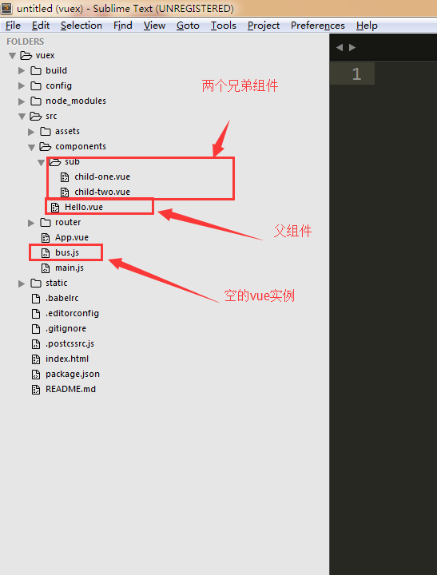
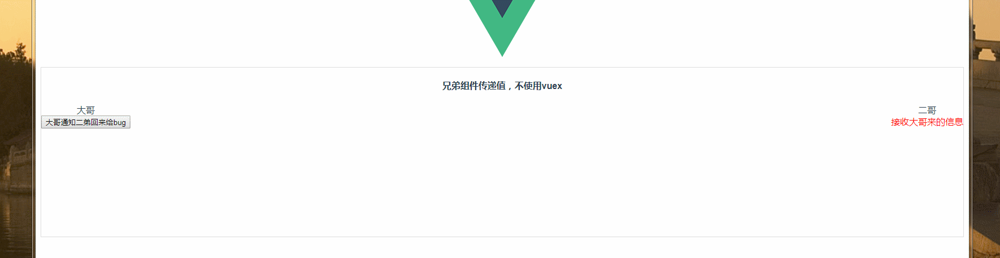

# vue-cli非父子组件之间传递值

简单的应用我们通过一个空的vue实例来作为中间变量进行值的传递，下面以vue-cli中非父子组件之间进行通信

简单的项目结构




全局的空vue实例,**bus.js**

```javascript
import Vue from 'vue'
let bus = new Vue()
export default bus
```

在**main.js**注册这个空的vue实例，这样后面使用的时候，不用每个组件都去引入

```javascript
// The Vue build version to load with the `import` command
// (runtime-only or standalone) has been set in webpack.base.conf with an alias.
import Vue from 'vue'
import App from './App'
import router from './router'
import Vuex from 'vuex'
import bus from './bus.js'  // 引入全局的空的vue实例
Vue.use(Vuex)
Vue.config.productionTip = false
Vue.prototype.$bus = bus // 添加到Vue的实例上,这样以后使用就不会每个组件都引入bus.js

/* eslint-disable no-new */
new Vue({
  el: '#app',
  router,
  template: '<App/>',
  components: { App }
})

```

###### 其中父组件hello.vue

```javascript
<template>
  <div class="hello">
    <div class="brothers-no-vuex">
      <h4>兄弟组件传递值，不使用vuex</h4>
      <child-one></child-one>
      <child-two></child-two>
    </div>
  </div>
</template>

<script>
import childOne from './sub/child-one'
import childTwo from './sub/child-two'
export default {
  name: 'hello',
  data () {
    return {
      count: 0
    }
  },
  methods: {
    sumCount () {
      this.count++
    }
  },
  components: {childOne, childTwo}
}
</script>

<!-- Add "scoped" attribute to limit CSS to this component only -->
<style scoped>
h1, h2 {
  font-weight: normal;
}

ul {
  list-style-type: none;
  padding: 0;
}

li {
  display: inline-block;
  margin: 0 10px;
}

a {
  color: #42b983;
}
.brothers-no-vuex{
  border: 1px solid #ddd;
  height: 300px;
}
</style>

```

###### 子组件一child-one.vue

```javascript
<template>
	<div class="childOne">
		<div>大哥</div>
		<button @click='tell'>大哥通知二弟回来给bug</button>
	</div>
</template>

<script>
	export default {
		name: 'childOne',
		methods: {
			tell () {
				this.$bus.$emit('childOne-tell-childTwo','老二赶紧回来改bug')
			}
		}
	}
</script>

<style scoped>
	.childOne{
		float: left;
		
	}
</style>
```

###### 子组件二child-two.vue

```javascript
<template>
	<div class="childTwo">
		<div>二哥</div>
		<span>{{msg}}</span>
	</div>

</template>

<script>
	export default {
		name: 'childTwo',
		data (){
			return {
				msg: '接收大哥来的信息'
			}
		},
		mounted: function(){
			this.$bus.$on('childOne-tell-childTwo', (data) => {
				this.msg = data
			})
		}
	}
</script>

<style scoped>
	.childTwo{
		float: right;
	}
	span{
		color: red
	}
</style>
```

在子组件一种通过下面的方法发布

```javascript
this.$bus.$emit('childOne-tell-childTwo','老二赶紧回来改bug')
```

在子组件二中通过下面的方法接收子组件一发送过来的值

```javascript
this.$bus.$on()
```

最后的结果

